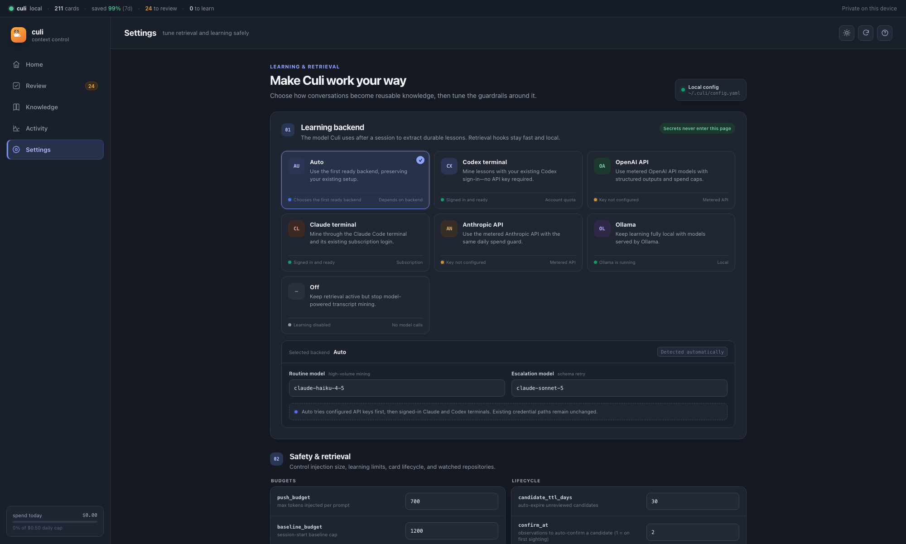

# Context control console

Start the local UI with:

```bash
culi serve
```

It listens on `localhost:7378` by default. The console is a local control surface over the same
Markdown store, SQLite activity index, and YAML configuration used by the CLI. It is not required
for hooks or MCP to work.

## Home

Home answers two questions first: “Is Culi working?” and “What needs my attention?” It shows:

- total cards and proposed lessons awaiting review;
- queued transcript-learning work and failed jobs;
- actual context delivered versus the estimated always-load-everything baseline;
- recent gate skips, learning spend, injection granularity, noisy cards, and stale cards;
- a seven-day Knowledge Pulse summary with shortcuts into the detailed analytics view.


Savings remain an estimate, not a billing claim. Culi compares observed injected tokens with the
counterfactual cost of loading the current knowledge corpus into every recorded session.

## Review

Learning produces candidate cards rather than silently changing confirmed knowledge. Review shows
the proposed body, evidence, scope, model provenance, and observation count before you decide.


Actions are reversible where possible and keyboard-friendly:

- `a` approve;
- `r` reject;
- `s` skip;
- `e` edit;
- `j` / `k` move through the queue;
- `Cmd+Z` undo the most recent supported action;
- `?` open the shortcut reference.

The Review navigation item displays the current candidate count without requiring the user to open
the screen first.

## Knowledge

The Cards view searches the canonical knowledge base and filters by type, status, and scope. Card
details expose compact/expanded content, triggers, provenance, delivery history, and safe actions
such as downranking or retirement.


Hand-authored cards are not destructively round-tripped through Culi's renderer. Machine-authored
cards can be edited through the console; retirement is preferred over deletion when history should
remain reversible.

### Knowledge Pulse

Switch Knowledge from Cards to Pulse to inspect real delivery activity from the last seven days.
Pulse aggregates by card and supports:

- all agents, Claude Code, or Codex filters;
- repository filtering based on the recorded working directory's Git root;
- active-card, session, delivery, token, and cross-harness counts;
- per-card sessions, deliveries, tokens, last use, repositories, and harness split;
- direct navigation back to an available card.

Removed cards remain visible in historical analytics but are clearly marked unavailable. This keeps
past delivery accounting honest without pretending the card still exists.

## Activity

Activity shows exactly what Culi delivered and learned per conversation. Session IDs retain harness
provenance (`claude:<id>` or `codex:<id>`), and filters narrow the trace by harness, repository, and
date range.


Injection rows link back to current cards when available. The trace is useful for answering “why did
the agent see this?” and for finding cards that are too broad, noisy, or stale.

## Settings

Settings exposes a whitelist of safe configuration fields. Writes preserve comments and unrelated
keys in `~/.culi/config.yaml`; the browser cannot write arbitrary YAML fields.



The Learning backend section shows live readiness for:

- Codex terminal login;
- OpenAI API key or key file;
- Claude terminal login or token file;
- Anthropic API key or key file;
- Ollama endpoint;
- automatic selection or disabled learning.

Changing provider also presents appropriate starting models. Additional sections cover prompt and
session budgets, candidate lifecycle, daily spend/call limits, job limits, gate vocabulary, and the
watched-repository manager.

Watched repositories feed import and repository-learning workflows. They do not limit normal
context injection; injection scope is derived from each session's working directory.

## Themes and privacy

The header toggle switches between production light and dark themes. On first load, Culi follows the
system preference; an explicit choice is saved to browser `localStorage` as `culi-theme`.

The console binds to localhost, reads local state, and sends no telemetry. Model traffic only occurs
through the learning/import backend you configured; browsing the console itself does not call a
model.

## Alternate address

```bash
culi serve --addr localhost:7380
```

Keep the listener on localhost unless you intentionally add your own network security layer. Culi's
console does not provide remote-user authentication.
